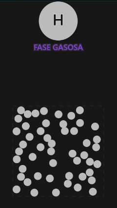
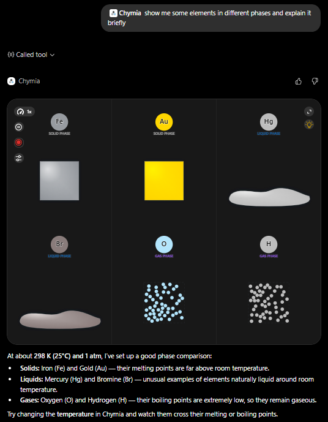

# 🧪 Chymia - The Interactive Chemistry Explorer

> Explore chemistry in a visual, interactive, and intelligent way. Available online at: [chymia.vercel.app/](https://chymia.vercel.app/) or [chatgpt.com/plugins](https://chatgpt.com/plugins)

**Chymia** is a web application for simulating and visualizing chemical elements, thermodynamics, and reactions. Built with a frontend particle simulation engine and integrated directly into **ChatGPT** via the Model Context Protocol (MCP), Chymia transforms the way students, researchers, and curious minds interact with the periodic table.

  

---

## 🤖 ChatGPT Integration (Store Approved)

The application has been officially approved as a **ChatGPT** Plugin, allowing you to control the simulation, ask complex chemistry questions, and receive thermodynamic data directly through the ChatGPT interface.

### How to use the integration?

1. Go to **[chatgpt.com/plugins](https://chatgpt.com/plugins)** (or click on the plugins/GPTs menu).
2. Search for **Chymia** and connect to the application.
3. Open a chat, type `@chymia` and try some commands.

**Prompt example:**

  

---

## ✨ Key Features

* **Real-Time Particle Simulator:** Custom physics engine (`ParticleCanvasLayer`) that simulates the behavior of gases, liquids, and solids based on thermodynamic properties.
* **Integrated AI Agent:** MCP (Model Context Protocol) server that exposes the web interface's chemical context to ChatGPT, allowing interactions with the AI, such as asking questions, and requesting specific elements and reactions.
* **Interactive Periodic Table:** Complete visualization rich in scientific data for all known elements.

---

## 🛠️ Tech Stack

The Chymia ecosystem is divided into two main fronts:

**Frontend (Client & UI):**
* **React, Vite & TypeScript:** Ensuring strict typing for scientific data and particle states.
* **Custom Physics:** Dedicated hooks (`usePhysics`, `thermodynamics.ts`) for spatial simulation calculations.

**AI Integration (MCP Server):**
* **Node.js:** Lightweight backend operating as an MCP server.
* **OpenAI API / ChatGPT:** Natural language interface for the chemical database.
* **Vercel:** Optimized hosting for high availability.
